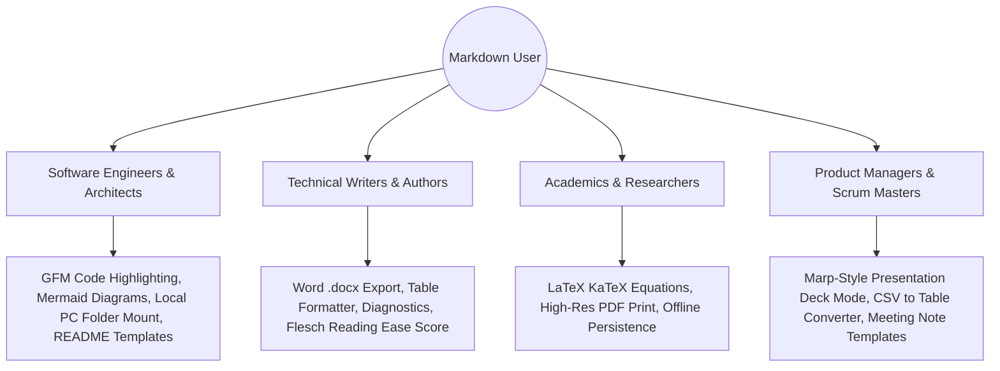

# Business Requirements Document (BRD) — Dnyx Draft

**Product Name**: Dnyx Draft  
**Document Version**: 4.0.0  
**Target Market**: Developers, Technical Writers, Researchers, Academics, Students  
**Status**: Approved & Released  

---

## 1. Executive Summary & Business Vision

Dnyx Draft is an enterprise-grade, local-first web application designed to be the single "All-In-One" Markdown editing, visualization, presentation, and document conversion platform. 

### Core Business Objectives
- **Zero Friction**: 100% browser-executable with zero required user accounts, logins, credit cards, or external server dependencies.
- **Data Sovereignty & Absolute Privacy**: All documents, folders, tags, and encrypted vaults reside entirely on the user's client machine via IndexedDB (Dexie.js) and the native Web File System Access API.
- **Market Leadership**: Surpass legacy tools (Dillinger, MarkdownLivePreview, StackEdit) by combining AST synchronized scrolling, LaTeX mathematics (KaTeX), Mermaid diagrams, native Microsoft Word (`.docx`) export, interactive table builders, full-screen presentation decks, and structural diagnostics under one unified interface.

---

## 2. Target User Personas & Value Propositions

---

## 3. Business Requirements & Capabilities Matrix

| Requirement ID | Capability Area | Description | Priority |
| :--- | :--- | :--- | :--- |
| **BR-01** | **Document Editing** | Real-time dual-pane editor with syntax highlighting, shortcuts (`Ctrl+B`, `Ctrl+I`, `Ctrl+F`), line numbers, and find/replace. | **Must Have** |
| **BR-02** | **Live AST Preview** | Instant rendering of GitHub Flavored Markdown (GFM), inline & block KaTeX equations, and Mermaid diagrams. | **Must Have** |
| **BR-03** | **Multi-Format Export** | Client-side export to Markdown (`.md`), standalone HTML (`.html`), formatted PDF print, and native Microsoft Word (`.docx`). | **Must Have** |
| **BR-04** | **Presentation Mode** | Turn documents into full-screen presentation slide decks sliced by `---` with keyboard navigation and progress indicators. | **Must Have** |
| **BR-05** | **Offline Local Storage** | Persistent document storage via Dexie.js (IndexedDB) with zero telemetry and optional AES-256-GCM encryption. | **Must Have** |
| **BR-06** | **Native File System** | Mount and edit local PC directories directly using the browser's Web File System Access API. | **Must Have** |
| **BR-07** | **Interactive Tools** | Spreadsheet-like visual table builder, CSV/TSV converter, table alignment linter, and Flesch readability diagnostics. | **Must Have** |
| **BR-08** | **SEO & AEO Visibility** | Complete OpenGraph, Twitter card metadata, dynamic sitemap/robots, JSON-LD schema, and AI agent endpoints (`llms.txt`). | **Must Have** |

---

## 4. Success Metrics & Key Performance Indicators (KPIs)

1. **Client Performance**: Sub-50ms keystroke-to-preview latency across documents with >10,000 words.
2. **Page Load Time**: First Contentful Paint (FCP) < 0.8s; Total First Load JS < 400 kB.
3. **SEO Ranking**: Top 5 organic search results for keywords like "online markdown editor", "markdown live preview", and "markdown to docx".
4. **Data Integrity**: 100% offline data retention with zero server roundtrips for core workspace editing.
