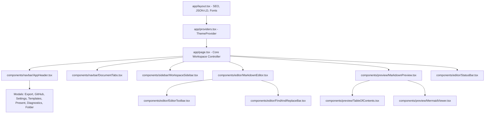

# Technical Requirements Document (TRD) — Dnyx Draft

**Architecture**: Next.js 16 (App Router) + Turborepo Monorepo  
**Language**: 100% Strict TypeScript (Target: ES2022)  
**State Architecture**: Zustand + Dexie.js (IndexedDB)  
**Styling**: Tailwind CSS v4 + PostCSS  
**Linter & Formatter**: Biome 1.9.4  
**Testing Framework**: Vitest 3.2.7 + React Testing Library + JSDOM  

---

## 1. System Architecture & Component Hierarchy



---

## 2. Technical Specifications by Layer

### 2.1 State Management (Zustand & Dexie.js)
- **`useWorkspaceStore`** (`lib/store/useWorkspaceStore.ts`):
  - Manages active document, open tab array, folder hierarchy, search query, selected tags, view mode, and sidebar toggle.
  - Transactions write asynchronously to IndexedDB via Dexie.js (`db.documents` & `db.folders`).
- **`useSettingsStore`** (`lib/store/useSettingsStore.ts`):
  - Persists user preferences (theme, font family, font size, tab size, sync scroll, line numbers).

### 2.2 Client-Side Rendering vs Server-Side Rendering
- **Server Shell (RSC)**: `app/layout.tsx` renders static SEO metadata, OpenGraph tags, JSON-LD schemas, and viewport configurations on the server for maximum crawler discoverability.
- **Client Components (`'use client'`)**: Interactive surfaces (editor, live preview, modals, tabs, sidebar) utilize React 19 client components with dynamic imports for heavy client libraries (`mermaid`, `docx`).

### 2.3 AST Parsing & Rendering Pipeline
- **Markdown AST**: `react-markdown` + `remark-gfm` + `remark-math`.
- **HTML Sanitization**: `rehype-raw` sanitized to eliminate malicious XSS script vectors.
- **Math Engine**: `rehype-katex` + KaTeX CSS for mathematical notation typesetting.
- **Diagrams**: Dynamic async client-side `mermaid.render()` with unique DOM IDs.

### 2.4 Document Conversion & Export
- **Word (`.docx`)**: `docx` library with Paragraph, Table, HeadingLevel, and TextRun builders in `lib/export/docx.ts`.
- **PDF Print**: Native `@media print` CSS rules with page-break controls.

---

## 3. SEO, AEO & GEO Infrastructure

```
public/
├── robots.txt                  # Search engine crawl directives
├── sitemap.xml                 # Search engine XML index
├── llms.txt                    # Generative Engine Optimization (GEO) endpoint
└── .well-known/
    └── llms.txt                # Well-known AI agent manifest
app/
├── robots.ts                   # Next.js dynamic robots route handler
└── sitemap.ts                  # Next.js dynamic sitemap route handler
```

---

## 4. Verification & Testing Standards

- **Static Analysis**: `pnpm check` (Biome) must pass with 0 errors and 0 warnings.
- **Type Checking**: `pnpm --filter web typecheck` (`tsc --noEmit`) must compile with 0 type errors.
- **Unit Testing**: Vitest test suite executing in JSDOM environment covering utilities, stores, and export engines.
- **Build Verification**: `next build` must generate static pages and API routes cleanly with optimized bundle sizes (< 400 kB First Load JS).
